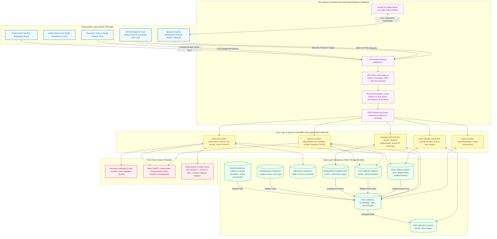
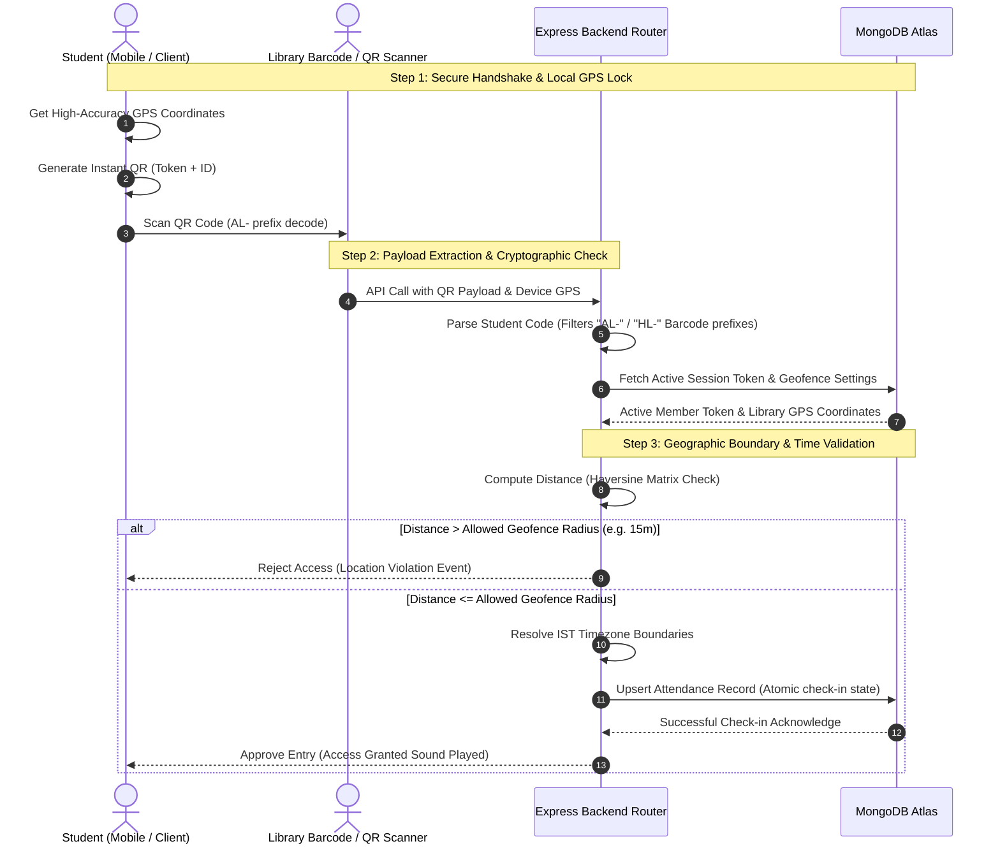
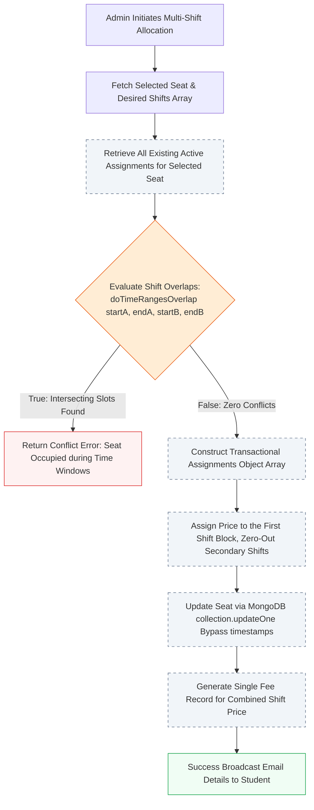

# Apna Lakshay -- Production-Grade Library Management System

[](https://apnalakshay.com)
[](https://mongodb.com)
[](https://pm2.keymetrics.io/)
[](https://apnalakshay.com)

**Live Production System:** [https://apnalakshay.com](https://apnalakshay.com)

A premium, full-stack, production-ready MERN enterprise suite engineered for modern offline libraries. The system handles end-to-end operations including interactive seat booking grids, multi-shift allocations, location-verified QR check-ins, automated billing cycles with partial payment tracking, and AI-powered academic engines. Built for scale, high reliability, and elite UI/UX standards, this codebase is designed according to enterprise software architecture best practices.

---

## Master System Architecture & Enterprise Design Blueprint

The entire Apna Lakshay LMS system is designed with a highly decoupled, layered architecture. The client interface communicates with a secured Express API gateway layer, driving specialized controller logic that acts as the core database state machine. Third-party gateways are integrated with reliable resilience pipelines, including an AI rate-limit fallback loop.



---

## GPS-Restricted QR Attendance Control Flow

Attendance integrity is enforced via a two-layer control loop: cryptographic token verification and geographic distance validation within a 15-meter radius, using highly precise spherical geodesy (Haversine formula).



---

## Multi-Shift Seat Overlap Verification Flow

Seats can be allocated to multiple students over distinct, non-overlapping time shifts. Conflicts are prevented via a deterministic interval overlap matrix prior to insertion.



---

## Technical Implementations & Production Details

This codebase solves critical enterprise-level challenges through resilient architectural decisions:

### 1. Robust Leaderboard Logic (Active Student Mapping)
* **Problem**: Traditional engagement trackers only query streak documents. Newly registered students who do not yet have an active study log are completely left out of leaderboard views.
* **Solution**: Re-implemented the engagement resolver to query the primary `User` collection directly for all active, non-disabled student profiles. The engine then populates corresponding `StudyStreak` documents on the fly. Missing values default to Level 1, 0 XP, 0 streak days, and 0 focus hours safely—preventing frontend ranking pagination failures.

### 2. Reliable Context Persistence (Preventing Target Reset)
* **Problem**: Incomplete backend payload returns during seat logins caused the frontend `AuthContext` to overwrite the local cache, resetting custom `examTarget` configurations to "generic" on page refresh.
* **Solution**: Refactored `verifySeatLogin` in the authentication controller to include complete profile objects (including explicit `examTarget` and outstanding test credits). Complemented this with a state fallback pipeline in the frontend context to prevent hydration race conditions.

### 3. Date-Locked Multi-Key Round-Robin AI Pipeline
* **Problem**: Severe rate-limiting during high-concurrency exam preparation periods.
* **Solution**: Engineered a dynamic API scheduler that rotates requests among a stack of active Groq keys. If the entire Groq stack triggers an HTTP 429 (Rate Limit), a fallback exception catcher shifts the traffic dynamically to Google Gemini API, ensuring zero student downtime.

### 4. Mongoose Timestamp Override Bypass
* **Problem**: Setting `timestamps: true` in Mongoose models locks the `createdAt` and `updatedAt` properties, making backdated admissions impossible to persist since `.save()` overwrites the inputs with the system time.
* **Solution**: Bypassed Mongoose schema locks using a native MongoDB driver update:
  ```js
  await User.collection.updateOne(
      { _id: userId },
      { $set: { createdAt: new Date(backdatedAdmissionDate) } }
  );
  ```

---

## Technology Stack

| Layer | Technology | Production Detail |
|---|---|---|
| **Frontend** | React.js (Vite Core) | SPA, Client-side routing, high-performance bundling |
| **Styling** | Tailwind CSS & Vanilla CSS | Dynamic Tailwind layers, HSL-themed UI tokens, Glassmorphism |
| **Animations** | Framer Motion | Smooth dashboard transitions, modular micro-animations |
| **Backend** | Node.js, Express.js | Structured controller-route MVC architecture |
| **Database** | MongoDB (Mongoose ODM) | Document storage, deep subdocument embedding for seats |
| **Real-time** | Socket.IO | High-concurrency bidirectional event loops for online status |
| **Security** | JWT (JSON Web Tokens) & bcrypt | Cryptographic session tokens, salt-hashed authorization |
| **Payments** | Razorpay Gateways | Direct webhook integration, secure online invoice settlements |
| **Mailing** | Brevo SMTP / Nodemailer | E-Commerce-style responsive HTML transacting templates |
| **AI Processing** | Groq & Gemini Pipelines | Intelligent syllabi mock generator, active chat sessions |

---

## Quick Start Guide

### Prerequisites
* **Node.js** v18.0.0 or higher
* **MongoDB** instance running locally on `mongodb://localhost:27017` or a MongoDB Atlas Cloud URI
* **Razorpay Key Credentials** (Merchant account details for Sandbox testing)
* **Groq API Cloud Key(s)** and **Google Gemini API Key**

### 1. Installation Blueprint

```bash
# Clone the repository
git clone https://github.com/himanshuraj108/Apna_Lakshay_LMS.git
cd Apna_Lakshay_LMS

# Install Backend Node Modules
cd backend
npm install

# Install Frontend Node Modules
cd ../frontend
npm install
```

### 2. Environment Configuration

Create a secure configuration file `backend/.env`:
```env
PORT=
MONGODB_URI=
JWT_SECRET=
JWT_EXPIRE=

# Email Configuration (Google App Password)
EMAIL_USER=
EMAIL_PASSWORD=
EMAIL_FROM_ADDRESS=

# Backup Email Configuration (Brevo SMTP)
BREVO_HOST=
BREVO_PORT=
BREVO_USER=
BREVO_PASS=

# App Download Link (for mobile users)
APK_DOWNLOAD_URL=

# Frontend URL (for CORS)
FRONTEND_URL=
# Admin Credentials (for seed and fallback)
ADMIN_EMAIL=
ADMIN_PASSWORD=

# Cloudinary Configuration
CLOUDINARY_CLOUD_NAME=
CLOUDINARY_API_KEY=
CLOUDINARY_API_SECRET=

# RSS2JSON API Key (for Exam Alerts feed)
RSS2JSON_KEY=

# Google Books API Key
GOOGLE_BOOKS_API_KEY=

# Groq AI API Key (Mock Test -- Free, Fast Llama 3)
GROQ_API_KEY=
GROQ_API_KEY_2=
GROQ_API_KEY_3=

# Library Geolocation (for attendance geo-fence)
LIBRARY_LAT=
LIBRARY_LNG=
LIBRARY_RADIUS_M=

# Payment Integrations
RAZORPAY_KEY_ID=
RAZORPAY_KEY_SECRET=
```

### 3. Database Seeding & Launch

```bash
# Seed the initial floors, custom shifts, and default admin credentials
cd ../backend
node scripts/seedData.js

# Launch Backend Engine
npm start

# In a new terminal: Launch Frontend Client
cd ../frontend
npm run dev
```

* **Backend Gateway:** `http://localhost:5000`
* **Frontend Web App:** `http://localhost:5173`

---

## Default Credentials Matrix

| System Role | Username / E-Mail Address | Secret Password |
|---|---|---|
| **Global Admin** | `admin` | `admin123` |
| **Demo Student** | `student@apnalakshay.com` | Generated & sent via SMTP mailer during creation |

---

## Production-Grade Features List

### Enterprise Admin Suite
* **Real-time Analytics Desk**: Track operational capacities, current seated volume, active online logs via web sockets, and payment pipelines.
* **Granular Student Management**: Fully operational CRUD console including status deactivation, custom profile photos, and backdated admissions.
* **Dynamic Geofenced Attendance**: Manual check-in overrides, instant barcode scanning processing, automated daily report builders, and Excel/PDF generators.
* **Flexible Seat Configuration**: Multi-floor visual map builder allowing AC/Non-AC tagging, granular seat status views, and instant seat-swaps preserving pricing rules.
* **Advanced Fee Invoicing**: Multi-shift balance split, customizable partial payment entries with colored highlights, and global payment gate toggle overrides.

### Premium Student Experience
* **Double-Sided Digital ID Card**: Beautiful sliding glassmorphic card equipped with:
  * **3D Flip Interaction**: Flips seamlessly on tap to display active rules, streak boosters, and rewards systems.
  * **QR Code Zoom Overlays**: Responsive barcode modal zoom optimized for high-speed scanner terminal decoding.
* **Monthly Attendance Calendar & Rankings**: Visual present/absent color grids accompanied by inclusive leaderboard rankings, highlighting the student with custom themes.
* **Interactive AI Doubt Assistant**: Conversational session engine pre-programmed with specific civil service and government examination syllabi.
* **Mock Test Generator**: Instant adaptive tests with standard negative-marking mechanisms, saved progress records, and dynamic scorecard breakdowns.
* **Built-in Study Tools**: High-fidelity Pomodoro timers, collaborative study streak rewards, and editable checklist boards.

---

## Complete Architecture Changelog

### v3.0.0 -- Leaderboard Resiliency, Persistent Auth Contexts & Zoomable QR Cards (May 2026)
* **Inclusive Engagement Leaderboards**: Updated engagement queries to list all registered students, gracefully defaulting absent StudyStreak entries to basic stats (Level 1, 0 XP) rather than omitting students without database documents.
* **Exam Target Hydration**: Integrated target persistence in the seat login controller and React authentication hooks. Resolves standard page reload hydration issues, securing state consistency.
* **Multi-Prefix Barcode Parsing**: Enhanced scanner input parsing logic to seamlessly resolve both AL- and HL- student card prefixes on check-in.
* **Double-Sided 3D Card Animations**: Rolled out absolute CSS 3D transform layers for profile student cards, featuring interactive flip states with rules content on the back.
* **High-Contrast QR Modal**: Integrated full-view overlay zooms with SVG renderers for seamless scanner check-ins.

### v2.5.0 -- Sub-Admin Permissions, Login Expiration & Seat Swap Enhancements (May 2026)
* **Sub-Admin ID Access**: Added specific id-card privileges to sub-admin configurations.
* **Ultra-Extended Sessions**: Extended JWT expiration parameters for secondary admin endpoints to 365 days, mitigating daily session timeouts.
* **Atomic Seat Swap Controller**: Created transactional seat swap endpoints, ensuring all seat types, negotiated fee configurations, and shift dates transfer concurrently.
* **Mobile ID Layout Polish**: Wrapped layout sections in ID components to prevent typography overflowing.

### v2.4.0 -- Unified Settings & PIN Attendance (May 2026)
* **FAB Pulse Contexts**: Refactored dashboard entry structures to display responsive, pulsing check-in actions.
* **Offline PIN Fallback**: Configured keypads to allow local pin code authentication when GPS signal boundaries fail.
* **Dynamic Global Toggles**: Unified settings into a clean dropdown control block on the admin panel.

### v2.1.0 -- Partial Billing & Razorpay Sandbox (Apr 2026)
* **Dynamic Balances**: Integrated orange partial-payment statuses, tracking outstanding amounts per billing cycle.
* **E-Mail Receipts**: Upgraded Nodemailer actions to automatically deliver responsive HTML receipts upon full or partial settlement.

---

## Engineering Core

* **Lead Architect:** [Himanshu Raj](https://github.com/himanshuraj108)
* **Enterprise License:** Proprietary -- All Rights Reserved. Used in live production daily.
